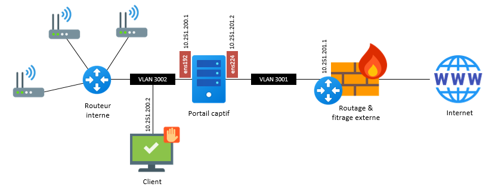

Installation manuelle
=====

Si vous ne pouvez pas utiliser le script d'installation automatique ou si vous souhaitez comprendre les différents points de configuration vous pouvez dérouler cette procédure manuelle. Il est cependant important de comprendre qu'elle a été écrite pour un système d'exploitation Debian et que des modifications et ajustements devront être fait pour d'autres plateformes.

Pré-requis réseaux
------------

Le schéma suivant synthétise un example de déploiement :

   
Le portail captif se positionnant en coupure de flux, la machine doit posséder deux interfaces réseaux. Dans l'exemple d'installation détaillé ici, les interfaces suivantes sont utilisées :

 - Interface clients : ``ens192`` *10.251.200.1/24*.
 - Interface externe : ``ens224`` *10.251.201.2/24*.

.. Important::

   La machine possédant plusieurs interfaces, il est nécessaire de bien configurer sa table de routage. La route par défaut doit passer par l'interface externe ``ens224`` et des routes statiques doivent être positionnées sur l'interface client ``ens192`` dans le cas ou elle comprendrait plusieurs subnets.

La configuration suivante peut être mise en place dans le fichier **/etc/network/interfaces** :

.. code-block:: bash

   source /etc/network/interfaces.d/*

   # The loopback network interface
   auto lo
   iface lo inet loopback

   # Interface interne
   allow-hotplug ens192
   iface ens192 inet static
           address 10.251.200.1/24

   # Interface externe
   allow-hotplug ens224
   iface ens224 inet static
           address 10.251.201.2/24
           gateway 10.251.201.1
           dns-nameservers 8.8.8.8

La table de routage initiale doit alors ressembler à :

.. code-block:: bash

   Destination     Passerelle      Genmask         Indic Metric Ref    Use Iface
   default         10.251.201.1    0.0.0.0         UG    0      0        0 ens224
   10.251.200.0    0.0.0.0         255.255.255.0   U     0      0        0 ens192
   localnet        0.0.0.0         255.255.255.0   U     0      0        0 ens224

Par la suite il vous faudra probablement ajouter une ou plusieurs routes statiques à destination du routeur interne si vous souhaitez utiliser le portail captif sur plusieurs sous réseaux *(VLANs)*. Nous recommandons alors de dédier un super-subnet comme un /16 à découper ensuite pour tous vos réseaux invités afin de simplifier les règles de routage.

Pré-requis système
------------

Le système d'installation automatisé est conçu pour être exécuté sur un environnement en **Debian 11**. Celui-ci peut être physique ou virtuel. Votre machine doit être connectée à Internet et être en mesure de télécharger des packages.

Nous recommandons de mettre à jour le système avant de démarrer l'installation :

.. code-block:: bash

   apt-get update && apt-get upgrade -y

Activation du routage
------------

La machine faisant office de routeur, cette fonctionnalité doit être activée sur le système. Nous conseillons également de désactiver IPv6. Pour ce faire, éditer le fichier ``/etc/sysctl.conf``

.. code-block:: bash

   net.ipv6.conf.all.disable_ipv6 = 1
   net.ipv4.ip_forward=1

Redémarrer le daemon avec la commande :

.. code-block:: bash

   sysctl -p /etc/sysctl.conf
   
Pour vérifier que le routage et correctement activé vous pouvez éxécuter la commande :

.. code-block:: bash

   cat /proc/sys/net/ipv4/ip_forward

   
Installation d'IPTables
------------

Cette étape doit être effectuée sur les machines ou le daemon ``nftables`` est installé. En effet il faut le remplacer par ``iptables`` pour pouvoir utiliser les fonctionnalités d'interception réseau du portail captif.

.. code-block:: bash

   apt-get remove -y --auto-remove nftables
   apt-get purge -y nftables
   apt-get update
   apt-get install -y iptables
   apt-get install -y iptables-persistent

Pour vérifier l'installation du firewall ``iptables`` vous pouvez éxécuter la commande :

.. code-block:: bash

   iptables -L -v

Installation du serveur DHCP (ISC)
------------

Afin de centraliser tous les services, nous conseillons d'installer le serveur DHCP pour les clients invités directement sur la machine hébergeant le portail captif. Cette étape n'est pas obligatoire et dépend de votre infrastructure. 

Installation du package :

.. code-block:: bash

   apt-get install -y isc-dhcp-server

.. note::
   
   Dans la configuration détaillée ici, l'interface interne est ``ens192``, elle a l'IP ``10.251.200.1/24``, vous devez adapter avec les éléments de votre propre installation.

Edition du fichier ``/etc/default/isc-dhcp-server`` pour spécifier l'interface réseau interne de la machine :

.. code-block:: bash

   INTERFACESv4="ens192"

Edition du fichier ``/etc/dhcp/dhcpd.conf`` pour configurer le service DHCP :

.. code-block:: bash

   option domain-name "guest.local";
   option domain-name-servers 10.251.200.1;
   default-lease-time 600;
   max-lease-time 7200;
   ddns-update-style none;
   subnet 10.251.200.0 netmask 255.255.255.0 {
       range 10.251.200.2 10.251.200.254;
       option subnet-mask 255.255.255.0;
       option broadcast-address 10.251.200.255;
       option routers 10.251.200.1;
   }
   
Redémarrer le service :

.. code-block:: bash

   service isc-dhcp-server start

Installation du serveur DNS (Unbound)
------------

Afin de centraliser tous les services, nous conseillons d'installer le serveur DNS pour les clients invités directement sur la machine hébergeant le portail captif. Cette étape n'est pas obligatoire et dépend de votre infrastructure.

Installation du package et téléchargement de la liste des DNS racines :

.. code-block:: bash

   apt-get install -y unbound
   wget ftp://ftp.internic.net/domain/named.cache -O /var/lib/unbound/root.hints

.. note::
   
   Dans la configuration détaillée ici, l'interface interne a l'IP ``10.251.200.1`` et le supersubnet content tous les réseaux invités est ``10.251.0.0/16``, vous devez adapter avec les éléments de votre propre installation comme le nom DNS de votre portail.
   
Edition du fichier ``/etc/unbound/unbound.conf`` pour configurer le service DNS :

.. code-block:: bash

   server:
   statistics-interval: 0
   extended-statistics: yes
   statistics-cumulative: yes
   verbosity: 3
   interface: 127.0.0.1
   interface: 10.251.200.1
   port: 53
   do-ip4: yes
   do-ip6: no
   do-udp: yes
   do-tcp: no
   access-control: 127.0.0.0/8 allow
   access-control: 10.0.0.0/8 allow
   access-control: 0.0.0.0/0 refuse
   root-hints: "/var/lib/unbound/root.hints"
   hide-identity: ye
   hide-version: yes
   harden-glue: yes
   harden-dnssec-stripped: yes
   use-caps-for-id: yes
   cache-min-ttl: 3600
   cache-max-ttl: 86400
   prefetch: yes
   num-threads: 6
   msg-cache-slabs: 16
   rrset-cache-slabs: 16
   infra-cache-slabs: 16
   key-cache-slabs: 16
   rrset-cache-size: 256m
   msg-cache-size: 128m
   so-rcvbuf: 1m
   unwanted-reply-threshold: 10000
   do-not-query-localhost: yes
   val-clean-additional: yes
   use-syslog: yes
   harden-dnssec-stripped: yes
   cache-min-ttl: 3600
   cache-max-ttl: 86400
   prefetch: yes
   prefetch-key: yes

   local-zone: "guests.local" static
   local-data: "portal.guests.local A 10.251.200.1"
   local-data-ptr: "10.251.200.1 portal.guests.local"

Redémarrer le service :

.. code-block:: bash

   service unbound restart

Redirection des fichiers de logs
------------

Par défaut les service DNS et DHCP écrivent leurs événements dans le fichier ``/var/log/messages``, il est préférable de les éclater dans des fichiers distincts.

Editer le fichier ``/etc/rsyslog.conf`` et ajouter à la fin :

.. code-block:: bash

   if ( $programname startswith "dhcpd" ) then {
       action(type="omfile" file="/var/log/dhcpd.log")
       stop
   }
   
   if ( $programname startswith "unbound" ) then {
       action(type="omfile" file="/var/log/unbound.log")
       stop
   }
   
Redémarrer le service :

.. code-block:: bash

   service rsyslog restart

Installation et configuration de PHP
------------

L'intégralité du code du portail captif est écrit en PHP. Il a été testé en ``PHP5.x`` et ``PHP7.x``.

Lancer l'installation des packages :

.. code-block:: bash

   apt-get install -y php php-mbstring php-mysqlnd php-ldap curl

.. note::
   Suivant les distributions, le fichier de configuration ``php.ini`` peut se trouver à différents endrois. Pour le trouver simplement, vous pouvez exécuter la commande ``find / -name php.ini``.

Editer le fichier de configuration ``php.ini`` et apporter les modifications suivantes :

.. code-block:: bash

   upload_max_filesize = 100M
   memory_limit = 256M
   post_max_size = 100M
